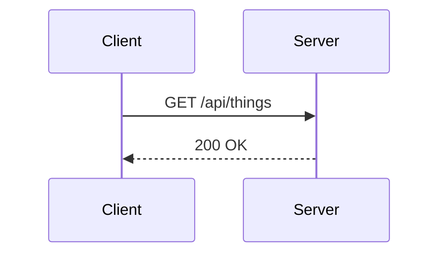
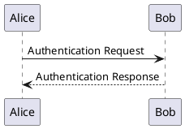

# arcanelabs.info

Company site for [Arcane Labs](https://arcanelabs.info). A Vite +
React + TypeScript single-page app that renders markdown-authored
content (with Mermaid and PlantUML diagram support) and deploys to
GitHub Pages on every push to `main`.

Every known route is pre-rendered to static HTML at build time, so
crawlers and first paint both get the full content. The client
hydrates and takes over SPA navigation from there.

## Local development

```bash
npm install
npm run dev          # vite dev server at http://localhost:5173
npm run build        # production build → dist/ (includes prerender + sitemap)
npm run build:ssr    # SSR-only bundle → dist-ssr/ (used by prerender)
npm run preview      # serve the production build locally
npm run typecheck    # tsc -b --noEmit
```

Node **22+** — see `.nvmrc`.

## Repository layout

```
content/              Authoring layer — add a .md, it shows up
  posts/              /writing/:slug — YYYY-MM-DD-slug.md
  projects/           /projects/:slug — slug.md
  pages/              home.md · company.md · contact.md

src/
  routes/             One component per route
  components/         TerminalShell, Nav, Footer, Markdown, Diagram, RouteEffects
  content/            loader.ts, head.ts, types.ts, frontmatter.ts
  styles/             editorial.css — the terminal-window design system
  entry-client.tsx    Browser entry — hydrateRoot / createRoot
  entry-server.tsx    SSR entry — createStaticHandler + renderToString
  App.tsx             Shared route config (client + server)

scripts/
  enumerate-routes.mjs  Lists every prerenderable URL
  prerender.mjs         Emits dist/<path>/index.html per route
  sitemap.mjs           Emits dist/sitemap.xml

public/               Static files copied verbatim to dist/
  CNAME                 arcanelabs.info
  robots.txt            points at /sitemap.xml
  404.html              SPA fallback for GH Pages deep links

.github/workflows/
  deploy-pages.yml      Auto-deploy on push to main
```

## Authoring content

### Posts

`content/posts/YYYY-MM-DD-your-slug.md`:

```md
---
title: "Your title"
description: "One-line preview shown on the /writing index."
date: 2026-04-20
---

Plain markdown after the frontmatter. The writing index picks this
up automatically. URL: /writing/your-slug
```

### Projects

`content/projects/your-project.md` — structured data in frontmatter,
prose in body:

```yaml
---
name: "project-name"
tagline: "One-sentence summary for the hero."
status: "Shipping"            # Shipping | Active build | Deprecated
install: "npx your-pkg@latest"  # optional — simple install commands
links:
  - label: "npm"
    url: "https://www.npmjs.com/package/your-pkg"
    note: "package on npm"
  - label: "GitHub"
    url: "https://github.com/you/your-project"
    note: "source code and README"
release:                      # optional — latest release block
  version: "v1.2.3"
  date: 2026-04-20
  notes: |
    ### What's new
    - Bullet about the change.
    - Another bullet.
---

Prose describing the project in more depth. This renders below the
hero and above the structured Install / Latest release / Links
sections on the project page.
```

### Pages

`content/pages/{home,company,contact}.md`:

```md
---
title: "Page title (used in <title>)"
description: "Used in <meta name=description> and on /writing index-style cards"
greeting: "Short one-liner shown with the > terminal prefix."
---

Body markdown. h2 headings (`## Section name`) render as
terminal-style `── SECTION ──` separators, matching the design
system's section rule without requiring layout classes in content.
```

### Diagrams

Fenced code blocks with `mermaid` or `plantuml`:

````md



````

Mermaid loads lazily — readers who never view a page with a diagram
don't download the ~700 KB mermaid bundle. PlantUML is encoded and
served by [kroki.io](https://kroki.io) (a free public service); no
Java runtime required.

## Deployment

Every push to `main` runs `.github/workflows/deploy-pages.yml`,
which:

1. `npm ci`
2. `npm run build` (client build → prerender → sitemap)
3. Uploads `dist/` as a Pages artifact
4. Deploys via `actions/deploy-pages@v4` to `arcanelabs.info`
   (custom domain pinned via `public/CNAME`).

### First-time setup

**Before the first push:** repo **Settings → Pages → Source** must
be set to **GitHub Actions** (not "Deploy from a branch"). This is
a one-click flip that can't be automated from inside a workflow.

### Troubleshooting

- **Blank page after deploy.** Usually a path/asset mismatch from a
  stale CDN cache. Hard-refresh. If it persists, check the browser
  console for 404s on `/assets/index-*.js` — means the deploy
  didn't publish the right files.
- **404 on deep links like `/writing/my-post`.** The post must be
  in `content/posts/` *before* the push, and its filename must match
  `YYYY-MM-DD-your-slug.md`. The prerender enumerates from disk; if
  the file isn't there at build time, there's no prerendered HTML
  and `/writing/my-post` falls through to the SPA-fallback
  `public/404.html`.
- **SPA fallback loops or flashes "home" briefly.** The
  `sessionStorage` redirect handshake in `public/404.html` +
  `src/entry-client.tsx` only activates for URLs that *aren't*
  prerendered. Prerender the URL to fix.
- **Sitemap dates are all "today".** Phase-6 known quirk: sitemap
  uses the build date for every URL, not the content's own
  frontmatter date. Crawlers still follow it.

## License

Code: MIT. Content: CC BY 4.0. See [LICENSE](LICENSE).
