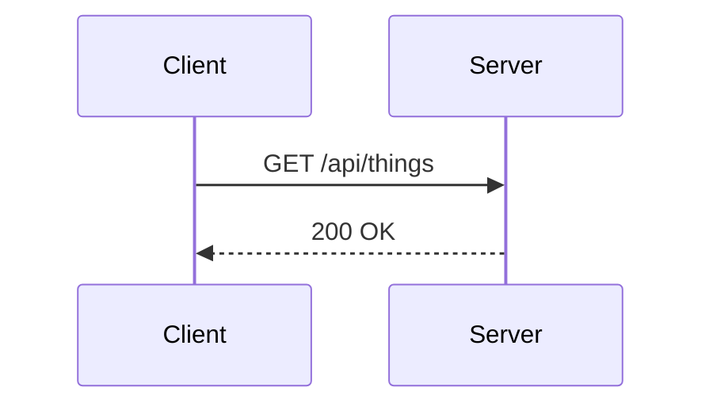
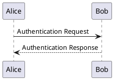

# arcanelabs.info

Company site for [Arcane Labs](https://arcanelabs.info). A Vite +
React + TypeScript single-page app that renders markdown-authored
content (with Mermaid and PlantUML diagram support) and deploys to
GitHub Pages on every push to `main`.

## Local development

```bash
npm install
npm run dev          # vite dev server at http://localhost:5173
npm run build        # production build → dist/
npm run build:ssr    # SSR bundle (phase 5 SSG prerender source)
npm run preview      # serve the production build locally
npm run typecheck    # tsc -b --noEmit
```

Node **22+** — see `.nvmrc`.

## Structure

```
content/              Authoring layer — add a .md, it shows up
  posts/              /writing/:slug — YYYY-MM-DD-slug.md
  projects/           /projects/:slug — slug.md
  pages/              home.md · company.md · contact.md

src/
  routes/             One component per route
  components/         TerminalShell, Nav, Footer, Markdown, Diagram
  content/            loader.ts, types.ts, frontmatter.ts
  styles/             editorial.css — the terminal-window design system
  entry-client.tsx    Browser entry — hydrateRoot/createRoot
  entry-server.tsx    SSR entry — createStaticHandler + renderToString
  App.tsx             Shared route config (client + server)

public/               Static files copied verbatim to dist/
  CNAME               arcanelabs.info
  robots.txt
  404.html            SPA fallback for GH Pages deep links

.github/workflows/
  deploy-pages.yml    Auto-deploy on push to main
```

## Authoring content

**Posts** go in `content/posts/` with the filename pattern
`YYYY-MM-DD-your-slug.md` and this frontmatter:

```yaml
---
title: "Your title"
description: "One-line preview shown on the /writing index."
date: 2026-04-20
---
```

Plain markdown after the frontmatter. The index picks it up
automatically. URL: `/writing/your-slug`.

**Projects** go in `content/projects/your-project.md`. See
`content/projects/forge.md` for the frontmatter contract (name,
tagline, status, install, links, release).

**Diagrams** use fenced code blocks:

````md



````

Mermaid renders client-side (lazy-loaded, so readers who never view
a diagram page don't download it). PlantUML is encoded and rendered
by [kroki.io](https://kroki.io) — a public, free service. No Java
runtime required.

## Deployment

Push to `main`. GitHub Actions runs `npm ci && npm run build` and
deploys `dist/` via `actions/deploy-pages@v4` to the custom domain
`arcanelabs.info` (see `public/CNAME`). The workflow is in
`.github/workflows/deploy-pages.yml`.

First-time setup: repo **Settings → Pages → Source** must be set to
**GitHub Actions** (not "Deploy from a branch").

## License

Code: MIT. Content: CC BY 4.0. See [LICENSE](LICENSE).
